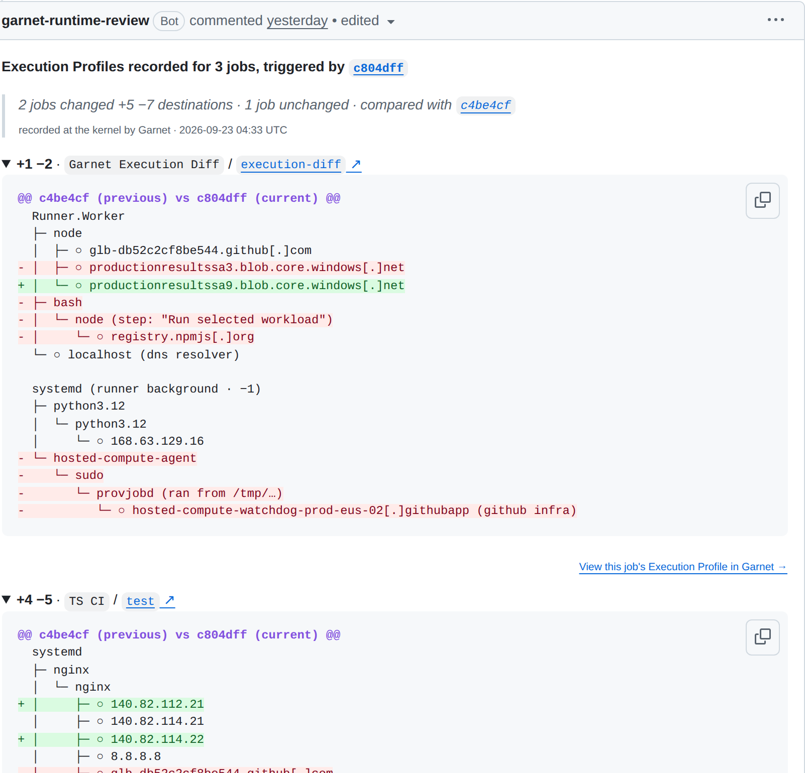

# Garnet Runtime Review

<div align="center">
  <a href="https://garnet.ai">
    
  </a>

  <p><strong>Runtime Review for your PRs</strong></p>

  <p>
    <a href="https://app.garnet.ai">Get an API token</a> ·
    <a href="https://docs.garnet.ai">Docs</a>
  </p>

  <p>
    <a href="../../releases">
      
    </a>
    <a href="./LICENSE">
      
    </a>
  </p>
</div>

---

Runtime context for code review: what your CI job actually ran, and where it connected.

Garnet runs [Jibril](https://github.com/garnet-org/jibril-releases), an eBPF sensor, on the runner for the duration of the job. It records each execution chain — one path through the process tree, from the runner's root process to an observed action, today an outbound connection — and the destination reached. The record is written to the job's Step Summary; the companion GitHub App posts it to the pull request. Garnet reports; you review.

One workflow step. No code changes.

- **Action**: adds the step; Jibril records the job; the Garnet Execution Summary lands in the job's Step Summary with a public Execution Profile permalink.
- **Companion GitHub App**: owns the single Runtime Review comment per pull request — one fold per recorded job, a comparison against the previous recorded commit, and a per-job Execution Profile link.

<p align="center">
  
</p>

<p align="center"><sub>Runtime Review comment posted by the companion GitHub App on <a href="https://github.com/garnet-labs/pnpm/pull/65#issuecomment-5780094095">a pnpm pull request</a> (Action v2.3.0, contract 6.10.0).</sub></p>

## What Garnet records

- **Execution chains and destinations, not contents** — process names, the step they ran under when known, and outbound domains, IPs, ports and protocols. Not your source, not your secrets.
- **Observe-only** — Jibril reads kernel events through eBPF programs checked by the kernel verifier. It does not block or modify anything.
- **Scoped egress** — the action and Jibril talk to `api.garnet.ai` (or your `api_url`) and download the Jibril release from `github.com/garnet-org/jibril-releases` over HTTPS. Releases from v2.17.0 (the default) ship as a signed bundle: checksums and manifest are verified, then `gh attestation verify` checks the signature; without `github_token` or the `gh` CLI that last step is skipped with a warning. Older releases are downloaded as a bare binary without verification.
- **Ephemeral** — Jibril runs as a systemd service and is stopped in the post step; its config and credentials are removed from the runner before the job ends.

## Permissions

| Permission | Required | Why |
| :--- | :--- | :--- |
| `contents: read` | Yes | The minimum job token. The action uses it for `gh attestation verify`, to fetch the running workflow file through the GitHub API when there is no checkout, and to read the job's status when no Execution Profile was produced. No write scope is needed; the action does not post comments. |
| `id-token: write` | Only without `api_token` | Lets the action request a GitHub OIDC token and exchange it with the Garnet control plane. Not needed when you pass `api_token`. |

The Action never needs `pull-requests: write`; the pull request comment is posted by the companion GitHub App under its own installation.

## Quickstart

### 1. Add the action to your workflow

**Already have a `GARNET_API_TOKEN`?** Keep it. Upgrading changes no permissions: the token is used as-is and no OIDC token is requested.

```yaml
on:
  push:
  pull_request:
  workflow_dispatch:

jobs:
  record:
    runs-on: ubuntu-latest

    permissions:
      contents: read

    steps:
      - name: Checkout (recommended)
        uses: actions/checkout@v6

      - uses: garnet-org/action@v2
        with:
          api_token: ${{ secrets.GARNET_API_TOKEN }}

      - name: Your existing steps
        run: |
          npm ci
          npm test
```

Create the token in [app.garnet.ai](https://app.garnet.ai) and store it as the repository secret `GARNET_API_TOKEN`.

**Without a token (GitHub OIDC):** grant `id-token: write` and omit `api_token`; the action requests a GitHub OIDC token and exchanges it with the control plane:

```yaml
    permissions:
      contents: read
      id-token: write

    steps:
      - uses: garnet-org/action@v2
```

When neither credential is available (typically fork `pull_request` and Dependabot runs), the action skips recording, logs a warning that names the missing credential, and writes the same explanation to the Job Summary. The workflow continues and the job is not marked failed.

> **Pinning:** `@v2` follows the latest `v2.x.x` release. To pin exactly, use the full commit SHA (Dependabot keeps SHA pins current):
>
> ```yaml
> # Pinned to v2.3.0
> - uses: garnet-org/action@f9ed14ab54564073ec11bba8d62d6980e172d2a0
> ```
>
> The SHA of the latest release is published at [garnet.ai/pins](https://garnet.ai/pins). Exact tags such as `garnet-org/action@v2.3.0` also work.

### 2. Install the companion GitHub App

[Install Garnet Runtime Review](https://github.com/apps/garnet-runtime-review/installations/select_target) on the repos you want recorded, or from Settings → GitHub in [app.garnet.ai](https://app.garnet.ai).

Since v2.3.0 the App is the only source of the pull request comment: the action no longer posts or edits comments. Without the App you still get the Job Summary and the Execution Profile in [app.garnet.ai](https://app.garnet.ai), but no comment on the PR. The App keeps one Runtime Review comment per pull request and updates it in place as each job's profile lands; It asks for four grants:

```yaml
pull-requests: write  # post and edit one Runtime Review comment per pull request
actions: read         # know when the run's jobs finish, so the comment updates in place
contents: read        # pull_request jobs run on a temporary merge commit; maps it back to your PR commit
metadata: read        # required by GitHub for every App
```

The App uses `contents: read` for one commit lookup only; it cannot push, and it cannot set a check or status.

## Not using GitHub Actions?

The same sensor runs anywhere Linux does.

- **`garnetctl` CLI + Jibril agent (any CI or host):** install [`garnetctl`](https://github.com/garnet-org/garnetctl-releases) and [`jibril`](https://github.com/garnet-org/jibril-releases) to record GitLab CI, Jenkins, Buildkite, self-hosted runners or a bare Linux host (kernel 5.10+, root for eBPF). Point it at `https://api.garnet.ai` with your API token; the Execution Profiles are the same.

  ```bash
  # Point garnetctl at the Garnet API and authenticate
  garnetctl config set-baseurl https://api.garnet.ai
  garnetctl config set-token <your-api-token>
  # Verify connectivity, then run the jibril agent on the host
  garnetctl version
  ```

- **Docker / Kubernetes:** run Jibril as a container or via the [Garnet Helm charts](https://github.com/garnet-org/helm-charts).

Installation guides for each path: [docs.garnet.ai](https://docs.garnet.ai).

## Comment anatomy

One comment per pull request, one fold per job, updated in place as each job's profile lands:

- **Headline** — `Execution Profiles recorded for N jobs, triggered by <sha7>`, linking the commit.
- **Metadata line** — one fact per `·` segment: destination count (or the change summary when a comparison exists), `recorded at the kernel by Garnet`, UTC timestamp.
- **One fold per job** — headed `workflow / job ↗ · N destinations`, the job linking to its Actions run. Inside: every recorded root of the job's process tree; independent roots separated by a blank line. Tree nodes are recorded process names; observed actions render as `○ destination`, defanged at the final dot. `(…)` carries factual context only — `(step: "Run tests")`, `(dns resolver)`, `(cloud metadata)`, `(github infra)`, `(garnet sensor)`, `(ran from /tmp/…)`. A job with no recorded egress stays a plain row with its profile link.
- **Per-job permalink** — `View this job's Execution Profile in Garnet →`, opening the [public run report](https://app.garnet.ai/public/runs/35818535654?profile=01a0cc87-186b-7be4-aa88-2a28f71e0744). The `?profile=` selector is part of the permalink; a bare run URL returns 404.
- **Explainer** — a `💡 How to read this` fold at the bottom:

<pre>
Runner.Worker          <em>← process on a path</em>
└─ npm
   └─ <strong>node</strong>             <em>← process that acted</em>
      └─ ○ npmjs[.]org <em>← observed action</em>
</pre>

follow a path downward to see what ran and what it did — each path to an observed action is an execution chain

names on the path = processes · ○ = observed action · (…) = context

Once a pull request has two recorded commits, the comment compares against the previous recorded commit: the metadata line carries `compared with <sha7>`, changed job rows lead with the delta (`+1 −2`), unchanged rows read `· N destinations · unchanged`, and a changed job's tree renders as a diff headed `@@ <previous> (previous) vs <current> (current) @@`. `+` marks a destination only in the current record, `−` one only in the previous record. Jobs recorded previously but not on this commit sit in one collapsed `jobs no longer recorded` fold.

The same record is appended to the job's Step Summary as the **Garnet Execution Summary** ([example run](https://github.com/garnet-labs/pnpm/actions/runs/35818535654)).

## Known limitations

Read the record for what it is: what Garnet recorded, not a statement that nothing else happened.

- **Step attribution is best effort.** `(step: "…")` labels come from correlating process start times with the runner's step boundaries. Some chains land under the wrong step or under `(step: "<unknown>")`. Capture is unaffected; read those as *step unknown*, not as background activity and not as a gap in the record.
- **Merge commit, not PR head.** On `pull_request` runs GitHub checks out the synthetic merge commit. The action reports your PR head SHA to Garnet, but the comment headline and the public Execution Profile currently label the run by the commit the workflow ran on — the merge commit. Aligning them to the PR head is tracked in the control plane.
- **Matrix jobs.** Jobs that share a name across a matrix can be aggregated under one fold and undercount destinations.
- **No completeness claim.** The record states what was captured; it does not declare that every connection was captured.
- **Post-step time.** Stopping the sensor waits for Jibril to flush its Execution Profile, bounded by `stop_timeout_seconds`. On busy jobs this has been measured at 1–3 minutes; lower the bound if post-step latency matters more than a complete flush.
- **Comparison needs a recorded pair.** The diff view appears only when the previous recorded commit on the pull request has a profile for the same job; otherwise the fold shows the current record alone.

## Under the hood

- **Main step**: downloads and verifies `jibril`, authenticates with the control plane (`api_token`, else GitHub OIDC), fetches your network policy and starts Jibril as a systemd service. If Jibril fails to start, later steps still run; the gap is disclosed in the job log and a Job Summary block with startup diagnostics, and a best-effort `start_failed` report is sent when the sensor was already registered.
- **Post step (always)**: stops Jibril so it flushes its record, appends the Garnet Execution Summary to `GITHUB_STEP_SUMMARY`, and logs the Execution Profile permalink. If the flush exceeds `stop_timeout_seconds`, the sensor is force-stopped so the job cannot hang. When no usable Execution Profile is produced, the post step reports that to the control plane so the App can resolve the pending comment. With `debug: "true"` it also uploads Jibril logs as artifacts.

---

## Configuration

| Input               | Required | Default                 | Description                                    |
| ------------------- | -------- | ----------------------- | ---------------------------------------------- |
| `api_token`         | No       | —                       | Garnet API token from app.garnet.ai. When set it is used as-is and no OIDC token is requested. When empty the action tries GitHub OIDC (`id-token: write`). With neither, recording is skipped with a warning and a Job Summary explanation; the workflow continues. |
| `github_token`      | No       | `${{ github.token }}`   | Used by `gh attestation verify` on the Jibril release and to read the job's status when no Execution Profile was produced. If unset, attestation verification is skipped with a warning. |
| `api_url`           | No       | `https://api.garnet.ai` | Garnet API base URL (HTTPS)                    |
| `jibril_version`    | No       | `v2.17.0`               | Jibril release tag (for example `v2.16.0`), `latest`, or empty to resolve from the action tag (`@v0` resolves to daily builds) |
| `stop_timeout_seconds` | No    | `1800`                  | Seconds Jibril gets at shutdown to finish writing its Execution Profile. The post step waits this long plus a small grace, then force-stops the sensor. `0` or negative disables the bound. |
| `debug`             | No       | `false`                 | Verbose logging; uploads Jibril logs as artifacts |
| `preview`           | No       | `false`                 | Render the full-fidelity Step Summary record. Unstable shape; may change without a major version bump |

> **Fork PRs:** `pull_request` runs from forks get no repository secrets and no `id-token: write`. The action skips recording with a warning and a Job Summary explanation; the workflow continues.
>
> **Dependabot PRs:** Dependabot-triggered runs read `secrets.*` from the Dependabot secrets store, so an Actions-only `GARNET_API_TOKEN` resolves empty and the action skips recording. To record them, add the same token under the same name in **Settings → Secrets and variables → Dependabot**.

---

## Outputs

| Output           | Description                                                          |
| ---------------- | -------------------------------------------------------------------- |
| `profile_result` | Reserved for compatibility; not set by this action |
| `report_url`     | Run URL set in the main step, before capture. Not a profile permalink and not proof of upload; use the `?profile=` link in the comment or Execution Summary. |
| `agent_id`       | Sensor identifier assigned at registration. Registration alone does not confirm capture. |

---

## Why

Code review sees the diff. CI runs it: postinstall scripts execute, agent-written steps spawn processes, build steps open connections. None of that is in the diff. Runtime Review puts the record of what ran, and where it connected, next to the review.

Worked example: [What Garnet saw during Shai-Hulud](https://www.garnet.ai/resources/garnet-saw-shai-hulud) — a postinstall hook bootstrapping Bun, running TruffleHog against runner secrets and registering a rogue runner, as it appears in an execution record.

---

## Setup & support

### Requirements

- Linux x86_64 runner with systemd (`ubuntu-latest` or a label from the table below)
- passwordless `sudo` (to install Jibril and run it as a systemd service)
- `api_token` from a repository secret, **or** `id-token: write` for GitHub OIDC

### Supported runners

| Runner | Labels | Notes |
| ------ | ------ | ----- |
| GitHub-hosted Linux | `ubuntu-latest`, `ubuntu-24.04`, `ubuntu-22.04` | x86_64 only |
| [Blacksmith](https://www.blacksmith.sh) Linux | for example `blacksmith-8vcpu-ubuntu-2404` | Used on [pnpm/pnpm](https://github.com/pnpm/pnpm) CI |
| [Depot](https://depot.dev/docs/github-actions/runner-types) Linux | for example `depot-ubuntu-24.04` | x86_64 labels only; `-arm` labels are skipped |

On Windows, macOS and arm64 the action logs a warning and skips recording; the workflow continues.

### Troubleshooting

| Symptom                                   | Fix                                                                                                    |
| ----------------------------------------- | ------------------------------------------------------------------------------------------------------ |
| "Garnet skipped this Runtime Review because no authentication mechanism was available" | `api_token` was empty and no OIDC token could be requested. Common on fork `pull_request` runs. Pass `api_token` from a secret or grant `id-token: write`; the job continues either way. |
| No pull request comment                   | The comment is posted by the companion GitHub App — [install it](https://github.com/apps/garnet-runtime-review/installations/select_target) on the repository. The Job Summary and the profile in app.garnet.ai do not depend on the App. |
| `(step: "<unknown>")` labels              | Step attribution is best effort (see Known limitations). The chain was recorded; only its step is unknown. |
| Post step is slow                         | The sensor is flushing its record. Lower `stop_timeout_seconds` to bound it. |
| No Execution Summary                      | Set `debug: "true"` to upload Jibril logs as artifacts, then inspect `jibril.log` and `jibril.err`. |

### Security & license

See [SECURITY.md](./SECURITY.md) to report vulnerabilities — or email [security@garnet.ai](mailto:security@garnet.ai). MIT — see [LICENSE](./LICENSE).

---

[app.garnet.ai](https://app.garnet.ai) · [docs.garnet.ai](https://docs.garnet.ai) · [garnet.ai](https://garnet.ai)
