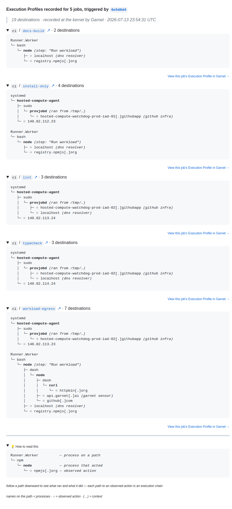

# Garnet Runtime Review

<div align="center">
  <a href="https://garnet.ai">
    
  </a>

  <p><strong>Runtime Review for your PRs</strong></p>

  <p>
    <a href="https://app.garnet.ai">Get an API token</a> ·
    <a href="https://docs.garnet.ai">Docs</a>
  </p>

  <p>
    <a href="../../releases">
      
    </a>
    <a href="./LICENSE">
      
    </a>
  </p>
</div>

---

Runtime review for CI/CD and agentic workflows in GitHub Actions.

Garnet is powered by [Jibril](https://jibril.garnet.ai), an eBPF sensor that attaches to your CI runner and records what each job did at the kernel: every execution chain — one path through the process tree, from the runner's root to an action; today, an outbound connection — and the destination it reached. The record posts back to your PR. You review it; Garnet only reports.

One YAML step. No code changes and minimal overhead.

Get your API token at [app.garnet.ai](https://app.garnet.ai). Start with the Action, then install the companion GitHub App for the full PR experience.

## What you get

- **Action stage**: Add the workflow step and Jibril records runtime from that job. The action self-posts a Runtime Review PR comment plus the GitHub Step Summary. Because the Action only knows its own jobs, the coverage line reads `k jobs recorded`, and the Execution Profile permalink is derived from the run_id.
- **Companion GitHub App stage**: Install the companion GitHub App for the full PR experience. The App owns the authoritative Runtime Review comment, can show true coverage (`k of n`), richer capability permalinks, Slack alerts, and cross-run management.
- **Chain-level evidence**: When something unexpected runs, you don't just see a domain name — you see the execution chain behind it.

<p align="center">
  
</p>

<p align="center"><sub>The action's own comment shape (renderer v6.9.5); the companion GitHub App comment adds true coverage and cross-run comparison.</sub></p>

## What Garnet sees

The only secret Garnet uses is the API token you pass it. It never reads your other secrets, and never writes to your repo.

- **Metadata, not contents** — an Execution Profile carries execution chains and outbound domains, IPs, ports, and protocols, not your source or your secrets.
- **Observe-only** — Jibril reads syscall-level events. Every eBPF program is checked by the kernel verifier before it loads and runs sandboxed.
- **Scoped egress** — the action and Jibril talk to `api.garnet.ai` (configurable via `api_url`) and download Jibril binaries from `github.com/garnet-org/jibril-releases` over HTTPS.
- **Ephemeral** — Jibril runs as a systemd service that is stopped in the post step; secrets and config files are removed from disk before the job ends.

## Permissions

| Permission | Required | Why |
| :--- | :--- | :--- |
| `contents: read` | Yes | Access workflow context and repository metadata |
| `pull-requests: write` | Recommended | Post the Runtime Review comment (standalone Action mode; unused once the companion GitHub App owns the comment) |

## Quickstart

### 1. Create a token

Create an API token in the Garnet app at <https://app.garnet.ai>, then add it as a repo secret named `GARNET_API_TOKEN`.

### 2. Add the action to your workflow

```yaml
on:
  push:
  pull_request:
  workflow_dispatch:

jobs:
  record:
    runs-on: ubuntu-latest

    permissions:
      contents: read
      pull-requests: write

    steps:
      - name: Checkout (recommended)
        uses: actions/checkout@v6

      - uses: garnet-org/action@v2
        with:
          api_token: ${{ secrets.GARNET_API_TOKEN }}

      - name: Your existing steps
        run: npm test
```

> **Tip:** Major tags such as `@v2` track the latest `v2.x.x` release automatically. For maximum supply-chain safety, pin to a full commit SHA (Dependabot keeps SHA pins up to date):
>
> ```yaml
> # Pinned to v2.2.0
> - uses: garnet-org/action@3d47f4a9004f7356c980a0e8d420ef5984750e3c
>   with:
>     api_token: ${{ secrets.GARNET_API_TOKEN }}
> ```
>
> The canonical SHA of the latest release is always at [garnet.ai/pins](https://garnet.ai/pins). Dependabot bumps SHA pins automatically. Exact tags such as `garnet-org/action@v2.3.0` remain available.

### 3. Install the companion GitHub App

[Install Garnet Runtime Review](https://github.com/apps/garnet-runtime-review/installations/select_target) on the repos you want recorded, or from Settings → GitHub in [app.garnet.ai](https://app.garnet.ai).

Two permissions, nothing else:

| Permission | Access | Why |
| ---------- | ------ | --- |
| Pull requests | Read & write | Post and update the one Runtime Review comment per commit |
| Metadata | Read | Required for every GitHub App |

The App writes the comment and does nothing else — no webhooks, no code access. Once installed it owns the comment across every recorded job on the commit, reconciles any comment the Action had already posted, and the Action stands down. The PR converges to a single Runtime Review comment.

## Not using GitHub Actions?

This action is the easiest way to get Garnet Runtime Review into a GitHub workflow, but it is not the only way to run Garnet. The same eBPF sensor works anywhere your code executes.

- **`garnetctl` CLI + Jibril agent (any CI or host):** Install the [`garnetctl`](https://github.com/garnet-org/garnetctl-releases) CLI and the [`jibril`](https://github.com/garnet-org/jibril-releases) agent to record runtime on GitLab CI, Jenkins, Buildkite, self-hosted runners, or a bare Linux host (kernel 5.10+, root/eBPF required). Point it at `https://api.garnet.ai` with your API token — the same Execution Profiles you get from this action.

  ```bash
  # Point garnetctl at the Garnet API and authenticate
  garnetctl config set-baseurl https://api.garnet.ai
  garnetctl config set-token <your-api-token>
  # Verify connectivity, then run the jibril agent on the host
  garnetctl version
  ```

- **Docker / Kubernetes:** Run Jibril as a container or via the [Garnet Helm charts](https://github.com/garnet-org/helm-charts) for cluster-wide runtime visibility.

Full installation guides for every path are in the [Garnet docs](https://docs.garnet.ai).

## Comment anatomy

One comment per PR, one fold per job, updated in place as each job's profile lands:

- **Headline** — `Execution Profiles recorded for N job(s), triggered by <sha7>`, linking the commit.
- **Metadata line** — an italic blockquote: `N destinations · recorded at the kernel by Garnet · <UTC timestamp>`, one fact per `·` segment.
- **One fold per job** — headed `workflow / job ↗ · N destinations`, the job id linking to its Actions run. Inside: one block holding every recorded root of the job's tree; independent roots are separated by a blank line. Plain tree nodes are recorded process names; observed actions render as shaped terminals — `○ destination` for network, defanged at the final dot. A process with an action directly beneath it renders **bold**; `(…)` brackets carry factual context only — `(step: "Run tests")`, `(dns resolver)`, `(cloud metadata)`, `(github infra)`, `(garnet sensor)`, `(ran from /tmp/…)`. A job with no recorded egress stays a plain row keeping its Garnet profile link.
- **Per-job permalink** — `View this job's Execution Profile in Garnet →`, opening the job's [public run report](https://app.garnet.ai/public/runs/31257440827?profile=019fe15d-b34f-7803-820a-ecf58404a278) (`?profile=` selector required — a bare run URL returns 404).
- **The explainer** — a `💡 How to read this` fold at the bottom teaches the tree with an annotated example:

<pre>
Runner.Worker          <em>← process on a path</em>
└─ npm
   └─ <strong>node</strong>             <em>← process that acted</em>
      └─ ○ npmjs[.]org <em>← observed action</em>
</pre>

follow a path downward to see what ran and what it did — each path to an observed action is an execution chain

names on the path = processes · ○ = observed action · (…) = context

Once a pull request has two recorded commits, the comment compares against the previous profiled commit: the metadata line carries `compared with <sha7>`, changed job rows lead with the bold delta (`+1 −2 destinations`), unchanged rows read `· N destinations · unchanged`, and a changed job's tree renders as a diff headed `@@ <previous sha7> (previous) vs <sha7> (current) @@`. `+` marks a destination only in the current record, `−` one only in the previous record; the marks and the row's delta always reconcile exactly. Jobs recorded previously but not on this commit sit in one collapsed `jobs no longer recorded` fold with their destination counts.

The same full-detail record is appended to the GitHub Actions Job Summary as the **Garnet Execution Summary** (see this [example run](https://github.com/garnet-org/action/actions/runs/23175135499)).

## Under the hood

- **Main step**: Downloads `jibril`, creates a Garnet agent via the control-plane API, fetches your merged network policy from the API, and starts Jibril as a `systemd` service on the runner. If Jibril crashes during startup, the action logs diagnostics and continues so later workflow steps still run.
- **Post step (always)**: Stops Jibril so it flushes events, appends the Garnet Execution Summary to `GITHUB_STEP_SUMMARY`, and creates or updates the pull request comment for the current push when the workflow runs for a PR. Multiple jobs and workflows from the same push merge into a single comment. When `debug=true`, it also uploads Jibril logs as build artifacts.

---

## Configuration

| Input               | Required | Default                 | Description                                    |
| ------------------- | -------- | ----------------------- | ---------------------------------------------- |
| `api_token`         | Yes¹     | —                       | Your Garnet API token from app.garnet.ai       |
| `github_token`      | No       | `${{ github.token }}`   | GitHub token used for pull request comments    |
| `api_url`           | No       | `https://api.garnet.ai` | Garnet API base URL                            |
| `jibril_version`    | No       | `""` (auto)             | Jibril version (for example `v2.16.0`, `v0.0`, or `latest`); empty resolves to the pinned stable release for your action ref (daily builds on `@v0`) |
| `debug`             | No       | `false`                 | Enable debug mode and upload logs as artifacts |
| `preview`           | No       | `false`                 | Render the full-fidelity Step Summary record (assertions + evidence); preview shape is unstable and may change without a major version bump |

¹ Required at runtime, with one exception: on `pull_request` runs from forked repositories, GitHub exposes no secrets, so the action emits a notice, skips recording, and the job continues. An OIDC alternative is landing behind the `GARNET_ACTION_ENABLE_OIDC_AUTH` flag; until that flag is on, the token is the auth path.

---

## Outputs

| Output           | Description                                                          |
| ---------------- | -------------------------------------------------------------------- |
| `profile_result` | Reserved for the companion GitHub App and control plane; this action records what happened |
| `report_url`     | The run's public report URL on app.garnet.ai; only exact `?profile=` permalinks from the comment or Execution Summary resolve — a bare run URL returns 404 |
| `agent_id`       | Identifier for the Jibril sensor instance that recorded this run     |

---

## Concepts

### Why Runtime Review matters

Your team reviews the code; your CI runs it. Between `git push` and production, dependencies execute postinstall scripts, AI-generated functions spawn processes, and build steps make outbound connections — none of which appear in a static scan. Garnet tells you what your pipeline actually did.

### Real incidents

- **Shai-Hulud** — 800+ npm packages with a second-stage payload. A postinstall hook bootstrapped Bun, ran TruffleHog to harvest runner secrets, then registered a rogue GitHub runner. [See the breakdown →](https://www.garnet.ai/resources/garnet-saw-shai-hulud)
- **Clinejection** — LLM agent prompt injection via a malicious GitHub Issue triggered code execution, poisoned the Actions cache, and exposed an npm publish token. Over 4,000 developers received a backdoored package within eight hours.
- **tj-actions/changed-files** — Supply-chain compromise in a widely pinned Action injected a memory scraper that printed runner secrets to public workflow logs across 23,000 repositories.

---

## Setup & support

### Requirements

- Linux x86_64 runner with systemd (`runs-on: ubuntu-latest` or another supported label below)
- `sudo` access to install binaries and configure the Jibril service
- `GARNET_API_TOKEN` set as a repository secret

### Supported runners

| Runner | Labels | Notes |
| ------ | ------ | ----- |
| GitHub-hosted Linux | `ubuntu-latest`, `ubuntu-24.04`, `ubuntu-22.04` | x86_64 only |
| [Blacksmith](https://www.blacksmith.sh) Linux | for example `blacksmith-8vcpu-ubuntu-2404` | Runs in production on [pnpm/pnpm](https://github.com/pnpm/pnpm) CI |
| [Depot](https://depot.dev/docs/github-actions/runner-types) Linux | for example `depot-ubuntu-24.04` | Intel (x86_64) labels only; `-arm` labels are skipped (Jibril ships amd64 binaries) |

On unsupported platforms (Windows, macOS, arm64) the action logs a warning and skips recording; your workflow continues unaffected.

### Troubleshooting

| Symptom                                   | Fix                                                                                                    |
| ----------------------------------------- | ------------------------------------------------------------------------------------------------------ |
| "API token is required"                   | Confirm `GARNET_API_TOKEN` is set in repository secrets and passed as `api_token`.                     |
| "Garnet skips profiling on pull requests from forked repositories" | Expected on fork PRs: secrets are unavailable there, so the action skips recording and the job continues. |
| No PR comment appearing                   | The action posts comments only on `pull_request` events — confirm your workflow includes that trigger. |
| PR comment says "Resource not accessible" | Add `pull-requests: write` to the workflow `permissions` block.                                        |
| No summary output                         | Enable `debug: "true"` to upload Jibril logs as artifacts, then inspect `jibril.log` and `jibril.err`. |

### Security & license

See [SECURITY.md](./SECURITY.md) to report vulnerabilities — or email [security@garnet.ai](mailto:security@garnet.ai). MIT — see [LICENSE](./LICENSE).

---

[app.garnet.ai](https://app.garnet.ai) · [docs.garnet.ai](https://docs.garnet.ai) · [garnet.ai](https://garnet.ai)
